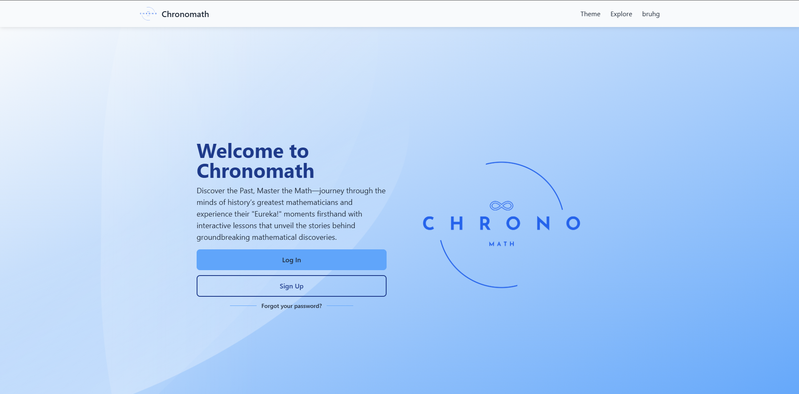
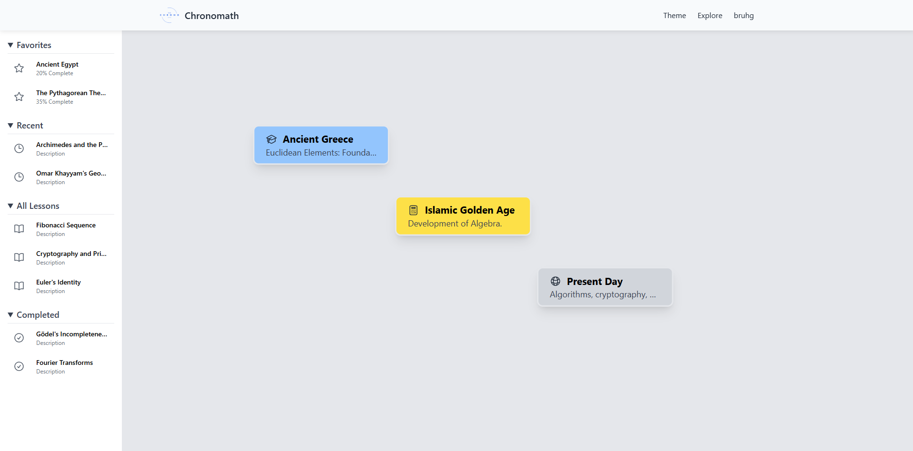
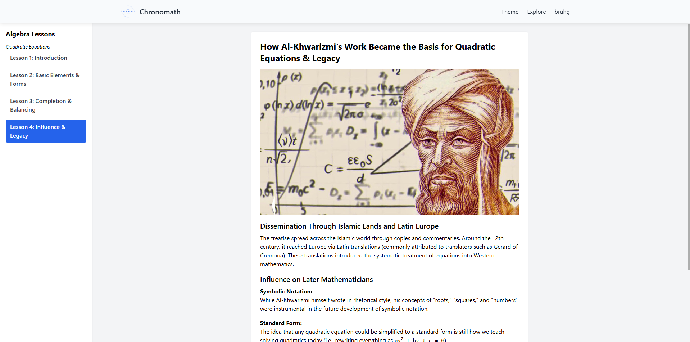
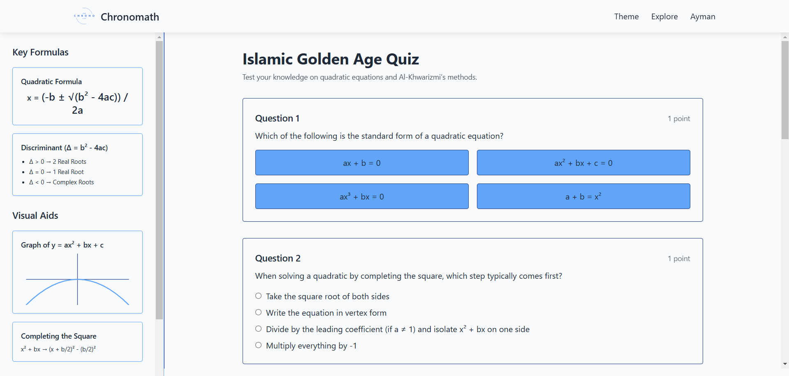

## Prerequisites

- [Python 3.13.2]([https://www.python.org/downloads/release/python-3132/])
- [Node 22.14.0]([https://nodejs.org/en/download/])
- Firebase Project

## Web App

Access the web app here:

[chronomath.duckdns.org](chronomath.duckdns.org)

## Self-Hosted Installation Guide

1. Clone the repository and navigate to the project directory:

```bash
git clone https://github.com/MdTanjeemHaider/ChronoMath
cd ChronoMath
```

2. Create a python virtual environment and activate it:

```bash
python -m venv venv

# on Windows
venv\Scripts\activate 

# on Linux or MacOS
source venv/bin/activate 
```

3. Install the required python packages:

```bash
pip install -r backend\chronomath\requirements.txt
```

4. Create a `.env` file in the `backend/chronomath/configs` directory and add the following lines:

```bash
FIREBASE_API_KEY=YOUR_FIREBASE_API_KEY
FIREBASE_AUTH_DOMAIN=YOUR_FIREBASE_AUTH_DOMAIN
FIREBASE_PROJECT_ID=YOUR_FIREBASE_PROJECT_ID
FIREBASE_STORAGE_BUCKET=YOUR_FIREBASE_STORAGE_BUCKET
FIREBASE_MESSAGING_SENDER_ID=YOUR_FIREBASE_MESSAGING_SENDER_ID
FIREBASE_APP_ID=YOUR_FIREBASE_APP_ID
FIREBASE_MEASUREMENT_ID=YOUR_FIREBASE_MEASUREMENT_ID
FLASK_SECRET_KEY=YOUR_FLASK_SECRET_KEY
```

5. Generate a new private key from the Firebase console and save it as `firebase_creds.json` in the `backend/chronomath/configs` directory.
6. Run the backend server:

```bash
python backend\chronomath\app.py
```

7. Open a new terminal and navigate to the project directory:

```bash
cd ChronoMath
```

8. Navigate to the frontend directory and install the required packages:

```bash
cd frontend\chronomath
npm install
```

9. Run the frontend server:

```bash
ng serve
```

## User Guide

To begin, the user is greeted with the front page where they can either log in or sign up to create an account, either locally with an email or though Google integration



Once logged in, the user is greeted with the home page, showing the timeline structure of lessons, a sidebar to navigate favorite, recent, all, and completed lessons, and a top bar where they can choose a theme, go back to the home page, or check their profile.



When a user selects a course, a pop-up will appear giving a quick summary of the topics covered, and after continuing the user is greeted with various pages display the lessons, each categorized by the unit and any sub-sections in the unit.



After the user goes through their lessons, they will be able to begin the quiz, where necessary information that may be difficult to remember is included on the left hand side, and a text notepad is included for users to write down notes and calculations.



## Current Features

Currently the major features implemented in the prototype include:

- Functional account creation when signing up and logging in implementation
- Home page with displayed timeline
- Lesson pages with unit, sub-section categorization with visuals implemented
- Quiz page
- Theme selection for users and accesbility themes for colorblind users
- Profile page

## Features to be implemented

Major features that still need to be added and/or improved include:

- Overhaul of the timeline and visual upgrade
- Score Tracking
- Lesson page interactivity
- Notebook functionality
- Profile page settings functionality
- More learning objectives in general
- Favoriting system

## Lesson References

[1] F. Rosen, *The Algebra of Mohammed ben Musa*. London: Oriental Translation Fund, 1831.  

[2] C. B. Boyer, *A History of Mathematics*, 2nd ed. Hoboken, NJ: John Wiley & Sons, Inc., 1991, p. 228.  

[3] C. B. Boyer, *A History of Mathematics*, 2nd ed. Hoboken, NJ: John Wiley & Sons, Inc., 1991, p. 229.  

[4] S. Gandz, "The sources of al-Khwarizmi's algebra," *Osiris*, vol. 1, pp. 263–277, 1936.  

[5] C. B. Boyer and U. C. Merzbach, *A History of Mathematics*, 3rd ed. Hoboken, NJ: John Wiley & Sons, 2011, pp. 229–230.  

[6] C. B. Boyer and U. C. Merzbach, *A History of Mathematics*, 3rd ed. Hoboken, NJ: John Wiley & Sons, 2011, p. 231.  

## Image References

[7] J. L. Esposito, ed., *The Oxford History of Islam*. Oxford University Press, 1999. ISBN: 0195107993. Available: [https://www.baytalfann.com/post/algorithms-algebra-astronomy-muhammad-ibn-musa-al-khwarizmi](https://www.baytalfann.com/post/algorithms-algebra-astronomy-muhammad-ibn-musa-al-khwarizmi).  

[8] "How to Solve Quadratic Equations," *WikiHow*, Available: [https://www.wikihow.com/Solve-Quadratic-Equations](https://www.wikihow.com/Solve-Quadratic-Equations).  

[9] J. Rus, "Quadratic Equation Graph," Own work, plotted with Desmos, Available: [https://www.desmos.com/geometry/26vfgc3gb3](https://www.desmos.com/geometry/26vfgc3gb3).  

[10] L. Vieira, "Mathematical Mysteries – Quadratic Equation," Own work, Available: [https://mathematicalmysteries.org/quadratic-equation/](https://mathematicalmysteries.org/quadratic-equation/).  

[11] "Al-Khwarizmi and Algebra," *Bayt al Fann*, Available: [https://www.baytalfann.com/post/algorithms-algebra-astronomy-muhammad-ibn-musa-al-khwarizmi](https://www.baytalfann.com/post/algorithms-algebra-astronomy-muhammad-ibn-musa-al-khwarizmi).  

[12] "Completing the Square," *Wikipedia*, Available: [https://en.wikipedia.org/wiki/File:Completing_the_square.ogv](https://en.wikipedia.org/wiki/File:Completing_the_square.ogv).